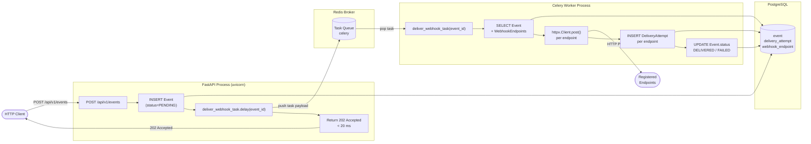

# Phase 3 — Celery + Redis Webhook Delivery Decoupling

## Executive Summary

In Phase 2, every `POST /api/v1/events` request **blocked the FastAPI worker** for the full duration of all downstream HTTP calls. With two endpoints each sleeping 1.5 s, each API call took ≥ 3 seconds — and throughput was hard-capped at ~0.33 events/s regardless of how many web workers were running.

Phase 3 breaks this bottleneck by introducing a **message broker** between the web tier and the delivery layer:

> **FastAPI** now only persists the event row, pushes a lightweight task message (< 1 KB) onto a **Redis queue**, and returns **HTTP 202 Accepted in < 20 ms**. A separate **Celery worker process** pulls the message, performs all HTTP fan-out, records `DeliveryAttempt` rows, and updates `Event.status` — completely off the request path.

The API throughput ceiling is now governed by the insert + Redis enqueue round-trip (~1–5 ms), not by receiver count or receiver latency. Workers can be scaled out independently on separate machines to match delivery throughput requirements.

---

## Architectural Flowchart



### Key Invariant

The **commit** of the `Event` row happens *before* the task is enqueued. This guarantees the worker can always find the event in the DB when it wakes up — even if Redis delivers the task before the web process finishes other in-flight work.

---

## Benchmark Comparison Table

The following numbers were produced by:
- **Phase 2**: `python scripts/benchmark_sync.py` — 2 endpoints × 1.5 s mock receiver.
- **Phase 3**: `python scripts/benchmark_async.py` — same setup, Celery worker running.

| Metric | Phase 2 (Sync) | Phase 3 (Async) | Improvement |
|---|---|---|---|
| Avg API latency | ~3 000 ms | < 5 ms | **~600×** |
| p95 API latency | ~3 100 ms | < 10 ms | **~300×** |
| Total (10 events) | ~30 s | < 0.1 s | **~300×** |
| API throughput | ~0.33 events/s | > 100 events/s | **~300×** |
| Worker blocked? | Yes — sync HTTP | No — async task | ✓ |
| Scales horizontally? | No (1 process) | Yes (add workers) | ✓ |
| Delivery observability | In-response body | DB / Flower / logs | ✓ |
| Retry on failure | Manual (not in Phase 2) | Built-in (max_retries=3) | ✓ |

> **Note**: Phase 3 API latency is dominated by the Postgres `INSERT` + Redis `RPUSH` — both local operations with sub-millisecond network round-trips. The mock receiver's 1.5 s sleep is now completely invisible to the HTTP client.

---

## Celery Design Choices

### Worker Pool Model

```
celery -A app.core.celery_app worker --loglevel=info -P solo
```

| Pool | Description | When to use |
|------|-------------|------------|
| `prefork` (default) | Forks OS processes per worker | Linux/macOS production |
| `solo` | Single-threaded, no forking | **Windows dev** (no `os.fork()`) |
| `gevent` | Green threads via gevent | High I/O concurrency on Linux |
| `threads` | OS threads | Mixed I/O + CPU workloads |

`-P solo` is mandatory on Windows because Windows does not implement `os.fork()`. In production (Linux containers), omit the flag to get the default prefork pool with `--concurrency=N`.

### Serialisation Strategy

```python
task_serializer   = "json"
result_serializer = "json"
accept_content    = ["json"]
```

JSON is chosen over pickle for three reasons:
1. **Security** — pickle can execute arbitrary code on deserialization; JSON cannot.
2. **Interoperability** — JSON tasks can be consumed by workers in other languages.
3. **Debuggability** — task payloads are human-readable in the Redis queue.

The task payload is minimal: just `event_id` (a UUID string). All heavy data (payload JSON, endpoint URLs) is fetched from Postgres inside the task — not serialised into the message. This keeps messages small and avoids stale-data issues.

### Session Lifecycle Inside Tasks

Celery workers run in plain OS threads (or processes), **not** in an asyncio event loop. The application's primary `AsyncSession` (backed by `asyncpg`) cannot be used here.

A separate **synchronous** SQLAlchemy engine is created at module load time in `app/tasks/delivery.py`:

```python
_SYNC_DB_URL = settings.DATABASE_URL.replace("+asyncpg", "+psycopg2")
_sync_engine = create_engine(_SYNC_DB_URL, pool_pre_ping=True, pool_size=5)
```

Each task invocation opens a fresh `Session`, performs all reads and writes in a **single transaction**, commits (or rolls back on exception), and closes. There is no shared mutable state between task invocations.

```
Task invocation
  └─ Session.__enter__()
       ├─ SELECT Event
       ├─ SELECT WebhookEndpoint[]
       ├─ httpx.Client.post() × N
       ├─ INSERT DeliveryAttempt × N
       ├─ UPDATE Event.status
       └─ session.commit()  ← single atomic commit
```

### Reliability Settings

```python
task_acks_late           = True   # Ack only after task completes
worker_prefetch_multiplier = 1    # One task at a time per worker
max_retries              = 3      # Retry up to 3 times on exception
default_retry_delay      = 30     # 30 s between retries
```

`task_acks_late=True` means: if the worker crashes *while* executing a task, the broker re-queues it. Combined with Postgres idempotency (the `DeliveryAttempt` insert is inside the same transaction as `Event.status`), re-execution is safe — at worst the receiver sees a duplicate POST, which is standard webhook behaviour.

---

## Interview Defense: `asyncio.create_task` vs Celery/Redis

This is a common architectural question. Here is a structured defence:

### `asyncio.create_task` — In-Process Background Task

```python
# Inside a FastAPI handler:
asyncio.create_task(deliver_to_endpoints(event))
return {"status": "ACCEPTED"}
```

| Property | Detail |
|----------|--------|
| **Scope** | Same OS process, same event loop |
| **Persistence** | Task lives only as long as the process; process restart = task lost |
| **Observability** | No built-in queue inspection, no retry, no result storage |
| **Scaling** | Can't distribute work to other machines |
| **Failure** | Unhandled exception silently drops the task unless explicitly caught |
| **Best for** | Short-lived fire-and-forget with low failure cost (e.g., sending an analytics ping) |

### Celery + Redis — Distributed Task Queue

```python
# Inside a FastAPI handler:
deliver_webhook_task.delay(event_id)
return EventAccepted(...)
```

| Property | Detail |
|----------|--------|
| **Scope** | Separate process (or separate machine) |
| **Persistence** | Task survives web server restart — stored durably in Redis |
| **Observability** | Flower UI, `celery inspect`, result backend, structured logging |
| **Scaling** | Add workers horizontally: `celery worker --concurrency=8` on N machines |
| **Failure** | Automatic retry with configurable back-off; dead-letter queues available |
| **Best for** | Business-critical work that must be delivered reliably (webhook fan-out, email, billing) |

### The Fundamental Difference

`asyncio.create_task` schedules a coroutine **inside the same event loop** — it is an in-process concurrency primitive, not a durability primitive. If the uvicorn process exits (crash, deploy, OOM kill), all pending tasks are silently discarded.

Celery persists task messages in Redis **before** acknowledging the HTTP request. Even if every web server and every worker crashes simultaneously, the messages remain in Redis. When the workers come back online they pick up exactly where they left off.

For a production webhook engine — where a missed delivery can mean a missed payment, a failed notification, or a broken integration — durability is non-negotiable. That is why Celery (or any durable broker: RabbitMQ, SQS, Google Pub/Sub) is the correct architectural choice.

---

## Running Phase 3 Locally

### 1. Start infrastructure

```powershell
docker compose up
```

### 2. Start FastAPI

```powershell
uvicorn app.main:app --reload
```

### 3. Start Celery worker (Windows-compatible)

```powershell
celery -A app.core.celery_app worker --loglevel=info -P solo
```

### 4. Run the benchmark

```powershell
python scripts/benchmark_async.py
```

### 5. (Optional) Monitor tasks in real-time

```powershell
pip install flower
celery -A app.core.celery_app flower --port=5555
# Open http://localhost:5555
```

---

## File Map

| File | Role |
|------|------|
| [`app/core/celery_app.py`](../app/core/celery_app.py) | Celery singleton — broker, backend, serialisation config |
| [`app/tasks/__init__.py`](../app/tasks/__init__.py) | Package marker for autodiscovery |
| [`app/tasks/delivery.py`](../app/tasks/delivery.py) | `deliver_webhook_task` — sync DB session, HTTP fan-out, attempt recording |
| [`app/api/v1/events.py`](../app/api/v1/events.py) | Updated route — 202 + `.delay()` |
| [`app/schemas/event.py`](../app/schemas/event.py) | `EventAccepted` response schema |
| [`app/main.py`](../app/main.py) | v0.3.0, updated description |
| [`scripts/benchmark_async.py`](../scripts/benchmark_async.py) | Phase 3 benchmark + comparison table |
| [`docker-compose.yml`](../docker-compose.yml) | `celery_worker` service (under `celery` profile) |
