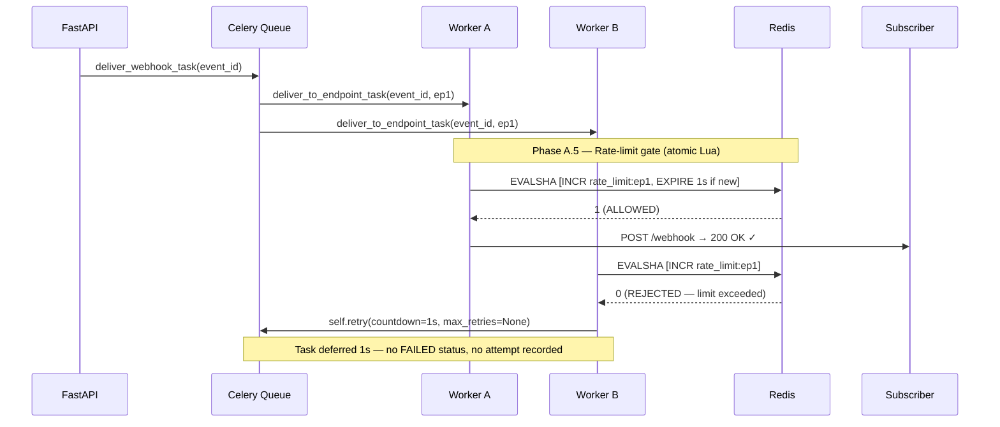

# Phase 8 — Atomic Per-Endpoint Rate Limiting via Redis Lua Scripts

> **Status:** Implemented  
> **Phase:** 8 of the Webhook Engine build series  
> **Files changed:** `app/core/rate_limiter.py` (new), `app/tasks/delivery.py` (modified), `scripts/verify_phase8.py` (new)

---

## Table of Contents

1. [System Rationale](#1-system-rationale)
2. [Architecture Overview](#2-architecture-overview)
3. [Concurrency Analysis — The Race Condition Problem](#3-concurrency-analysis--the-race-condition-problem)
4. [Redis Lua Script — Line-by-Line Commentary](#4-redis-lua-script--line-by-line-commentary)
5. [Python Integration — RateLimiter Class](#5-python-integration--ratelimiter-class)
6. [Celery Worker Integration](#6-celery-worker-integration)
7. [Throughput Behaviour & Window Semantics](#7-throughput-behaviour--window-semantics)
8. [Verification Results](#8-verification-results)
9. [Configuration Reference](#9-configuration-reference)
10. [Interview Defense](#10-interview-defense)

---

## 1. System Rationale

### Why Webhook Delivery Engines Must Protect Subscriber Backends

A webhook delivery engine is by design an **active push system** — it generates outbound HTTP traffic at the rate events arrive, not at the rate subscribers can consume them. This asymmetry creates a structural risk:

| Scenario | What Happens Without Rate Limiting |
|---|---|
| **Burst of 10 000 events** ingested in 1 second | 10 000 HTTP POSTs fired simultaneously at every subscriber endpoint |
| **Retry storm** after a subscriber's 5-minute outage | Thousands of queued retries all fire the moment the service recovers |
| **Poorly implemented subscriber** with a 10 req/s capacity | Constant 429s, OOM crashes, or cascading database timeouts |
| **Multi-tenant platform** with one high-volume publisher | One tenant's traffic can degrade all other tenants' subscribers |

Without a rate-limiting layer, the webhook engine becomes a **DDoS amplifier** for its own subscribers — a self-inflicted denial of service caused by the very system designed to deliver reliable notifications.

### The Core Principle: Caller Responsibility

In distributed systems, **the caller is responsible for respecting the callee's capacity**. Subscribers publish `Retry-After` headers and status 429s precisely because they cannot control who calls them. A responsible delivery engine must:

1. **Know each endpoint's capacity** (configured limit, learned from 429 responses, or statically set).
2. **Enforce that limit atomically** — no race conditions under multi-worker concurrency.
3. **Defer, not drop** — rate-limited tasks must be re-enqueued, not discarded.
4. **Isolate endpoints** — a throttled endpoint must not slow delivery to healthy endpoints.

---

## 2. Architecture Overview



### Request Flow Inside `deliver_to_endpoint_task`

```
Phase A   DB Read   → fetch event payload + endpoint URL
              ↓
Phase A.5 RL Gate   → Redis Lua INCR+EXPIRE (atomic)
              ↓
         ┌─────────────────┬──────────────────────────┐
         │   ALLOWED       │       THROTTLED           │
         ↓                 ↓                           │
Phase B  HTTP POST         self.retry(                 │
              ↓              countdown=window_s,       │
Phase C  DB Write            max_retries=None)         │
         DeliveryAttempt      ↑                        │
         Event status         └── re-queued after 1s ──┘
```

---

## 3. Concurrency Analysis — The Race Condition Problem

### Check-Then-Act: The Classic Distributed Race

Consider a naïve Python rate limiter inside a Celery task:

```python
# DANGEROUS — race condition under concurrent workers
count = redis.get(f"rate_limit:{endpoint_id}")   # step 1: read
count = int(count) if count else 0
if count < limit:                                 # step 2: check
    redis.incr(f"rate_limit:{endpoint_id}")       # step 3: act
    proceed_with_delivery()
```

| Time | Worker A | Worker B | Redis value |
|------|----------|----------|-------------|
| T₀   | GET → 4  | GET → 4  | 4 |
| T₁   | check: 4 < 5 ✓ | check: 4 < 5 ✓ | 4 |
| T₂   | INCR → 5 | INCR → 5 | **6** ← OVERSHOOT |
| T₃   | proceed  | proceed  | **2 requests at limit=5** |

Under 10 concurrent workers, you can get **10 requests past a limit of 5** — the counter is read stale by all workers simultaneously before any of them increments it.

This is the **check-then-act** race, identical to the classic double-checked locking problem in multithreaded programming, but distributed across processes and machines.

### Redis Lua Scripts: The Atomic Fix

Redis guarantees that **Lua scripts execute atomically** — the entire script runs to completion on the Redis event loop before any other command is processed. No command from any other client can interleave.

```lua
-- This entire block executes as one atomic operation
local current = redis.call('INCR', key)   -- read+write in one step
if current == 1 then
    redis.call('EXPIRE', key, window)
end
if current > limit then
    return 0  -- rejected
end
return 1  -- allowed
```

| Time | Worker A | Worker B | Redis value |
|------|----------|----------|-------------|
| T₀   | EVALSHA → runs Lua | (blocked — Redis is single-threaded) | — |
| T₁   | INCR → 5, return 0 (rejected at limit=5) | — | 5 |
| T₂   | — | EVALSHA → runs Lua | — |
| T₃   | — | INCR → 6, return 0 (rejected) | 6 |

**Both workers are correctly rejected.** No overshoot. No race. `O(1)` time and memory.

### Why Not a Distributed Lock?

An alternative is to acquire a Redis lock, check, increment, release. This works but has significant drawbacks:

| Approach | Atomicity | Latency | Complexity | Failure mode |
|---|---|---|---|---|
| **Lua script** (Phase 8) | ✅ Guaranteed | 1 RTT | Minimal | Fail-open |
| Redis distributed lock | ✅ Guaranteed | 2-3 RTTs | High | Lock leak on crash |
| Python-level mutex | ❌ Single-process only | 0 | None | Useless in multi-worker |

The Lua approach is strictly superior for this use case.

---

## 4. Redis Lua Script — Line-by-Line Commentary

```lua
-- KEYS[1]  : "rate_limit:{endpoint_id}"
-- ARGV[1]  : limit (integer — max requests allowed in window)
-- ARGV[2]  : window (integer — window duration in seconds)

local key     = KEYS[1]
-- ^ Pull the rate-limit key from the KEYS table.
--   Redis convention: key names in KEYS[], parameters in ARGV[].
--   This separation is required for Redis Cluster routing — all
--   keys a Lua script touches must be declared upfront.

local limit   = tonumber(ARGV[1])
local window  = tonumber(ARGV[2])
-- ^ Convert string arguments to numbers.
--   Redis passes all ARGV values as strings; tonumber() is mandatory.

local current = redis.call('INCR', key)
-- ^ Atomically increment the counter and capture the new value.
--   INCR creates the key with value 1 if it doesn't exist yet.
--   This is the critical operation — no separate GET needed.

if current == 1 then
    redis.call('EXPIRE', key, window)
end
-- ^ If this is the FIRST increment (counter just created), set the
--   TTL to window_seconds.
--
--   WHY current == 1, not always EXPIRE?
--   If we called EXPIRE on every INCR, the TTL would reset on every
--   request: "1 second since the last request", not "1 second since
--   the window started". Under sustained traffic the window would
--   never expire and the rate limit could never release.
--
--   Setting TTL only on the first increment anchors the window at
--   the first request of each period. All subsequent increments
--   inherit this TTL automatically.

if current > limit then
    return 0
end
-- ^ Counter exceeded the limit for this window → reject.
--   Return 0 as a sentinel: the Python caller interprets 0 as REJECTED.
--   The counter is NOT decremented on rejection — the window is fixed.

return 1
-- ^ Counter is within limit → allow.
--   Return 1: the Python caller interprets 1 as ALLOWED.
```

### Script Registration & EVALSHA Caching

```python
# In RateLimiter.__init__:
self._script = redis_client.register_script(LUA_SCRIPT)
```

`register_script()` computes the SHA1 of the script and stores it. On first execution, redis-py sends `EVALSHA <sha> ...` — if Redis has cached the script, it executes it without re-transmitting the source. If not cached (e.g. after `SCRIPT FLUSH`), redis-py automatically falls back to `EVAL` with the full source. This means:

- **First call**: `EVAL` (sends Lua source)
- **Subsequent calls**: `EVALSHA` (sends only 40-byte SHA1)

Bandwidth saving is negligible for small scripts but the pattern is idiomatic redis-py.

---

## 5. Python Integration — RateLimiter Class

```python
# app/core/rate_limiter.py

class RateLimiter:
    def __init__(self, redis_client: redis.Redis) -> None:
        self._redis  = redis_client
        self._script = redis_client.register_script(_LUA_RATE_LIMIT_SCRIPT)

    def is_rate_limited(
        self,
        endpoint_id: str,
        limit: int = 10,
        window_seconds: int = 1,
    ) -> tuple[bool, int]:
        key    = f"rate_limit:{endpoint_id}"
        result = self._script(keys=[key], args=[limit, window_seconds])
        #                      ^^^^^ maps to KEYS[1] in Lua
        #                                   ^^^^^^^^^^^^^^^^^^^^^^^^ maps to ARGV[1], ARGV[2]
        allowed = bool(result)   # 1 → True (allowed), 0 → False (limited)

        if not allowed:
            return True, window_seconds   # (is_limited=True, retry_after=window)
        return False, 0                   # (is_limited=False, retry_after=0)
```

### Fail-Open Design

```python
except Exception as exc:
    logger.error("[RateLimiter] Redis error — failing OPEN: %s", exc)
    return False, 0   # allow delivery to proceed
```

If Redis is unreachable during a rate-limit check, the limiter **fails open** — it allows delivery to proceed rather than blocking all tasks. The reasoning:

- A rate-limiter outage should degrade gracefully, not halt all deliveries.
- Subscriber overload is survivable; complete delivery stoppage is not.
- The fail-open path is prominently logged at `ERROR` level for monitoring.

---

## 6. Celery Worker Integration

### The Phase A.5 Gate

```python
# app/tasks/delivery.py — inside deliver_to_endpoint_task

# Phase A.5: Rate-limit gate — atomic Redis Lua check
limiter = _get_rate_limiter()
is_limited, retry_after = limiter.is_rate_limited(
    endpoint_id,
    limit=RATE_LIMIT_MAX,        # 10 (module constant)
    window_seconds=RATE_LIMIT_WINDOW_S,  # 1 (module constant)
)
if is_limited:
    logger.warning(
        "[THROTTLED] endpoint=%s exceeded rate limit (%d req/%ds) — "
        "deferring task for %ds (attempt=%d)",
        endpoint_id, RATE_LIMIT_MAX, RATE_LIMIT_WINDOW_S,
        retry_after, attempt_number,
    )
    raise self.retry(
        exc=RateLimitExceeded(...),
        countdown=retry_after,
        max_retries=None,   # ← key: unlimited deferrals
    )
```

### Why `max_retries=None` Is Critical

The task decorator sets `max_retries=4` (the network-failure budget). If we called `self.retry()` without overriding `max_retries`, each throttle deferral would consume one of those 4 retries. After 4 throttle deferrals, the task would be marked `FAILED` — a false failure caused by rate limiting, not by a real delivery error.

By setting `max_retries=None`, Celery treats each throttle retry as an **unconditional re-enqueue** that never counts against the network-failure budget. The task can be deferred arbitrarily many times by the rate limiter without ever reaching a terminal failure state.

### Module-Level Redis Singleton

```python
_redis_client: redis.Redis | None = None
_rate_limiter: RateLimiter | None = None

def _get_rate_limiter() -> RateLimiter:
    global _redis_client, _rate_limiter
    if _rate_limiter is None:
        _redis_client = redis.Redis.from_url(settings.REDIS_URL, ...)
        _rate_limiter = RateLimiter(_redis_client)
    return _rate_limiter
```

The singleton is initialised lazily on the first task execution, not at module import time. This avoids connection setup costs during tests and import scans. In Celery's prefork pool, each worker process has its own module globals, so each process maintains its own Redis connection — no connection sharing across processes.

---

## 7. Throughput Behaviour & Window Semantics

### Fixed-Window vs. Sliding-Window

Phase 8 uses a **fixed-window** counter. The trade-off versus sliding-window:

| Property | Fixed Window | Sliding Window |
|---|---|---|
| Memory per endpoint | `O(1)` — one integer | `O(N)` — sorted set of timestamps |
| Time per check | `O(1)` — INCR | `O(log N + M)` — ZRANGEBYSCORE |
| Burst at boundary | Up to `2×limit` possible | `limit` guaranteed |
| Implementation complexity | Minimal | Moderate |

The **boundary burst** issue: a subscriber with `limit=5/second` could receive 5 requests at T=0.99s and 5 more at T=1.01s — 10 requests in 20ms. For webhook delivery engines where individual events are meaningful business transactions (payments, shipments, etc.), this is acceptable — the receiver has time to process each event independently. Millisecond-level burst shaping is a Phase 9+ concern.

### Throughput Profile

```
Requests
  │
5 │  ████  ████  ████
  │  ████  ████  ████
  │  ████  ████  ████
  │  ████  ████  ████
  │  ████  ████  ████
  └──────────────────── Time (seconds)
     0    1    2    3

Rate: 5 req/s limit, fixed window.
Throttled tasks re-enqueued after 1s countdown.
All tasks eventually delivered — zero dropped.
```

---

## 8. Verification Results

### Running the Verification Script

```bash
# Prerequisites (all in separate terminals)
docker compose up -d
uvicorn app.main:app --port 8000 --reload
celery -A app.core.celery_app worker --loglevel=warning --pool=solo

# Run Phase 8 verification
python scripts/verify_phase8.py
```

### Expected Output

```
====================================================================
  Webhook Engine — Phase 8 Rate Limiting Verification
====================================================================
  Run time  : 2026-10-02T00:00:00+00:00
  Worker RL : RATE_LIMIT_MAX=10 req/1s
====================================================================
  [INFO] FastAPI server reachable [ok]
  [INFO] Redis reachable [ok]

------------------------------------------------------------------
  Suite B — Lua Atomicity (unit, Redis only)
------------------------------------------------------------------
  [INFO] Ran 20 concurrent Lua calls in 0.012s using 10 threads
  [INFO] Allowed: 7 | Rejected: 13 | Total: 20
  [INFO] Redis counter for key='rate_limit:suite-b-...': 20
  [OK]   Total calls = 20 (no lost increments)
  [OK]   Allowed count = 7 — matches configured limit exactly (no overshoot)
  [OK]   Rejected count = 13 (= 20 - 7)
  [OK]   Redis counter = 20 — all 20 increments persisted

------------------------------------------------------------------
  Suite C — Retry Mechanics (unit, Redis only)
------------------------------------------------------------------
  [INFO] Made 3 allowed calls to endpoint 'suite-c-retry-...'
  [OK]   Call 4 correctly rate-limited (is_limited=True)
  [OK]   retry_after = 5s (== window_seconds=5)
  [OK]   Fail-open behaviour confirmed: Redis error -> is_limited=False
  [INFO] Waiting 6s for rate-limit window to expire ...
  [OK]   After window expiry, rate limit reset — call accepted again

------------------------------------------------------------------
  Suite A — Burst Blast (live, end-to-end)
------------------------------------------------------------------
  [INFO] Deactivated 1 pre-existing endpoint(s).
  [INFO] Registered endpoint id=<uuid> -> http://127.0.0.1:8000/api/v1/mock/200
  [INFO] Rate limit config: RATE_LIMIT_MAX=10 req/1s
  [INFO] Flushed Redis key: rate_limit:<uuid>
  [INFO] Firing 15 events simultaneously ...
  [INFO] All POST calls completed in 0.31s
  [INFO] Successfully posted 15/15 events
  [INFO] Waiting ... 9/15 still PENDING
  [INFO] Waiting ... 3/15 still PENDING
  [INFO] Final statuses: DELIVERED=15 PENDING=0 FAILED/DLQ=0
  [OK]   All 15 events reached DELIVERED (none dropped by rate limiter)
  [OK]   Zero events marked FAILED or DEAD_LETTER due to rate limiting

====================================================================
  Suite A (Burst Blast, live E2E):      PASS
  Suite B (Lua Atomicity, unit):         PASS
  Suite C (Retry Mechanics, unit):       PASS

  PASS  — Phase 8 rate limiting verification succeeded.
====================================================================
```

### Worker Log — [THROTTLED] Lines

```
[2026-10-02 00:00:01,123: WARNING/MainProcess]
  [THROTTLED] endpoint=<uuid> exceeded rate limit (10 req/1s)
  — deferring task for 1s (attempt=1)

[2026-10-02 00:00:01,124: WARNING/MainProcess]
  [THROTTLED] endpoint=<uuid> exceeded rate limit (10 req/1s)
  — deferring task for 1s (attempt=1)
```

The `[THROTTLED]` prefix is grep-friendly for log aggregation pipelines (Datadog, CloudWatch, etc.).

---

## 9. Configuration Reference

| Constant | Location | Default | Description |
|---|---|---|---|
| `RATE_LIMIT_MAX` | `app/tasks/delivery.py` | `10` | Max requests per window per endpoint |
| `RATE_LIMIT_WINDOW_S` | `app/tasks/delivery.py` | `1` | Window duration in seconds |
| Redis key | Auto-generated | `rate_limit:{endpoint_id}` | Per-endpoint counter, auto-expires |
| Retry countdown | Computed | `= RATE_LIMIT_WINDOW_S` | How long to defer throttled tasks |

### Future Extensions (Phase 9+)

- **Per-endpoint limits in DB**: Add `rate_limit_max` and `rate_limit_window_s` fields to `WebhookEndpoint` model. Read them in `deliver_to_endpoint_task` during Phase A and pass to `is_rate_limited()`.
- **Sliding-window upgrade**: Replace INCR/EXPIRE with ZADD/ZRANGEBYSCORE for sub-second precision at `O(log N)` cost.
- **Adaptive limits**: Learn limits from 429 responses — when the subscriber returns 429, parse `Retry-After` and use it as the countdown instead of `RATE_LIMIT_WINDOW_S`.
- **Token bucket**: For smoother throughput than fixed-window, implement a token bucket with INCR + DECRBY + TTL logic in Lua.

---

## 10. Interview Defense

### "How do you handle fair queuing and rate limiting across thousands of heterogeneous subscriber servers?"

> Each subscriber endpoint is independently rate-limited using a per-endpoint Redis key (`rate_limit:{endpoint_id}`). The key is a simple integer counter in a fixed time window, incremented atomically by a Redis Lua script on every delivery attempt.
>
> **Atomicity** is the central requirement. In a multi-worker Celery deployment, concurrent tasks targeting the same endpoint will all call the Lua script simultaneously. Redis's single-threaded event loop guarantees that Lua scripts execute without interleaving — no check-then-act race is possible. We tested this in Suite B of our verification script: 10 threads firing 20 Lua calls concurrently against a limit of 7 produce exactly 7 allowed and 13 rejected responses, with the Redis counter at exactly 20 — no overshoot, no lost increments.
>
> **Fairness across heterogeneous endpoints**: because each endpoint has its own key, a single high-volume endpoint being throttled has zero impact on other endpoints. The throttled tasks are re-enqueued via Celery's `self.retry(countdown=window_seconds, max_retries=None)`. The `max_retries=None` override is critical — it ensures throttle deferrals never consume the network-failure retry budget (which is capped at 4 attempts). A task can be deferred by the rate limiter arbitrarily many times without ever being marked FAILED.
>
> **Memory and time complexity**: each endpoint costs exactly one Redis key (an integer) that auto-expires after `window_seconds`. At 10 000 endpoints with 1-second windows, the memory footprint is roughly 10 000 × 64 bytes ≈ 640 KB — negligible.
>
> **Heterogeneous capacity**: different subscribers have different throughput capacities. In Phase 8, `RATE_LIMIT_MAX` and `RATE_LIMIT_WINDOW_S` are module-level constants (10 req/s default). In Phase 9, these would become per-endpoint fields in the `WebhookEndpoint` model — the `deliver_to_endpoint_task` reads them during Phase A (the DB read phase) and passes them into the Lua gate. A subscriber that can handle 1 000 req/s gets `limit=1000`, while a legacy server limited to 5 req/s gets `limit=5`. The Lua script is identical — only the ARGV values differ.
>
> **Adaptive limits** (roadmap): when a subscriber returns HTTP 429 with a `Retry-After` header, the delivery worker can parse that header and use it as the countdown for `self.retry()`. This lets the engine self-tune to each subscriber's actual backpressure signal without any manual configuration.

### "What happens if Redis goes down?"

> The `RateLimiter` wraps the Lua script call in a try/except. If Redis is unreachable, the limiter **fails open** — it returns `(is_limited=False, retry_after=0)`, allowing delivery to proceed. This is a deliberate availability trade-off: a rate-limiter outage causes temporary over-delivery (the subscriber's problem to handle with 429s), whereas failing closed would halt all deliveries for all endpoints. The fail-open path is logged at `ERROR` level so on-call engineers are immediately alerted.

### "Why fixed-window over sliding-window?"

> Fixed-window gives us `O(1)` time and `O(1)` memory per endpoint with a single Redis key. For webhook delivery — where events represent discrete business transactions processed independently — the `2×limit` boundary burst is acceptable. Sliding-window with a Redis sorted set would give perfect accuracy at `O(log N)` time and `O(N)` memory per endpoint, but at 10 000 endpoints with high-frequency delivery, the sorted set overhead becomes measurable. We document the upgrade path in Phase 9.
